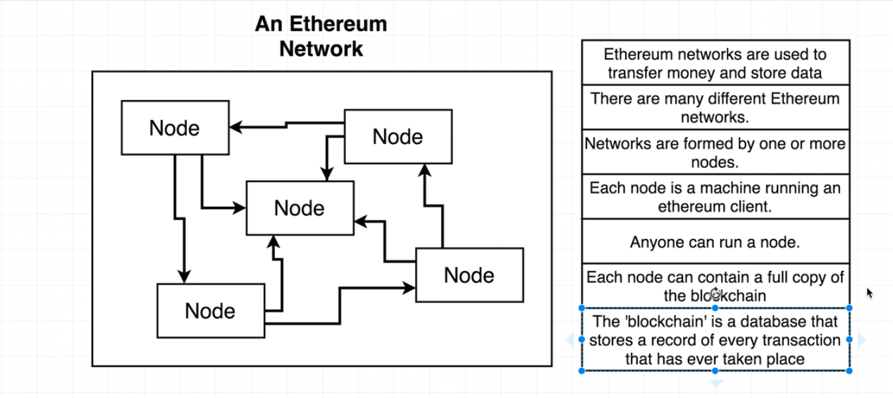
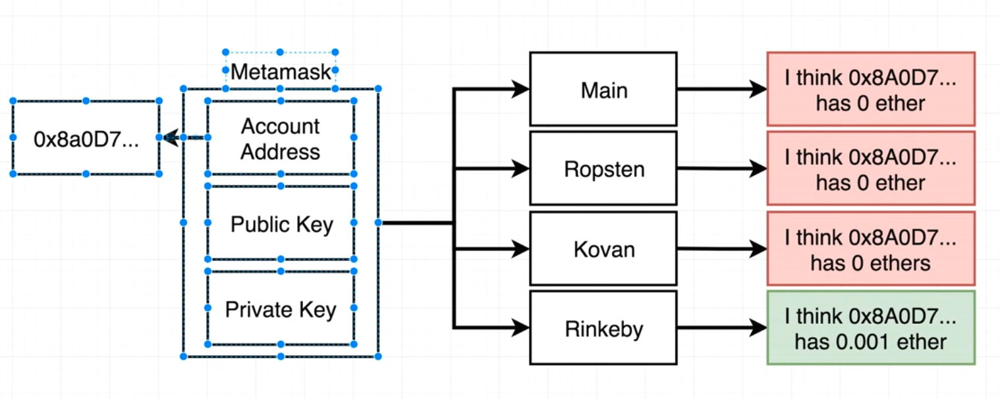
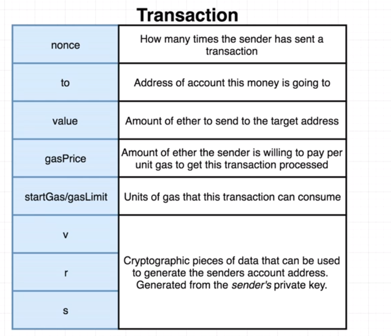
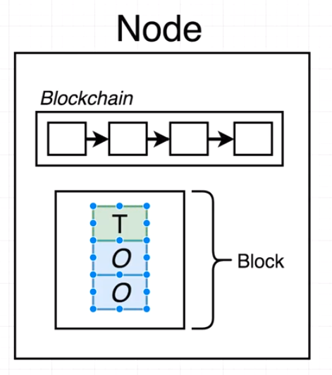
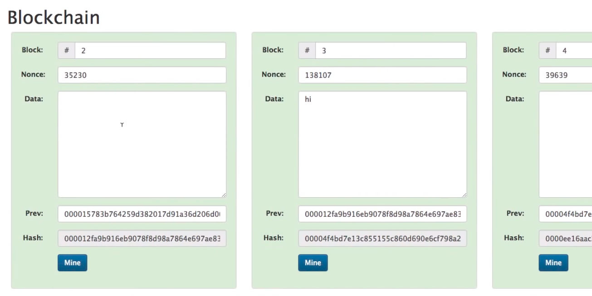

# Ethereum And Solidity

## Introduction

* What is ethereum?

* How can we connect to the network?
  * Developers: `web3.js`
  * Consumers
    * Metamask: Browser extension
    * Mist Browser: Full feature web browser

* Using Metamask
  * Generate an account (mnemonic)
  * You can host your local Ethereum network at local 8545
  * Custom RPC: Connect to a remote network using a custom address

* Metamask account:
  * Account address: shareable unique identifier (username)
  * Public key
  * Private key (both public and private is a like a password)
    * All those pieces of data are stores as hexadecimal numbers

* Sending tokens using Metamask:
  * http://rinkeby-faucet.com/
  
  * What is a transaction?
    * `web3.js`: creates a transaction object
    

* How is a blockchain block structured:
    * `nonce`: Basically a counter of transactions done using your account. So, lets say you have done 100 transactions already, that classed your next transaction with a `nonce` of 101
    * `v`, `r`, `s`: Sender generates those values with his private key (one way process). You cannot recalculate the private key
    * When some transactions get assembled inside a block:
    
      * The node start running some calculations on the block, that is called Mining
      * Mining is the process of finding a hash  that starts with `0000` 4 0s (signed block).
      

* Distributed Blockchain
  * We have many peers with copies of the blockchain. Consequently, if one of the peers changes some past block of his block chain, that will not match his neighbors blockchain.
