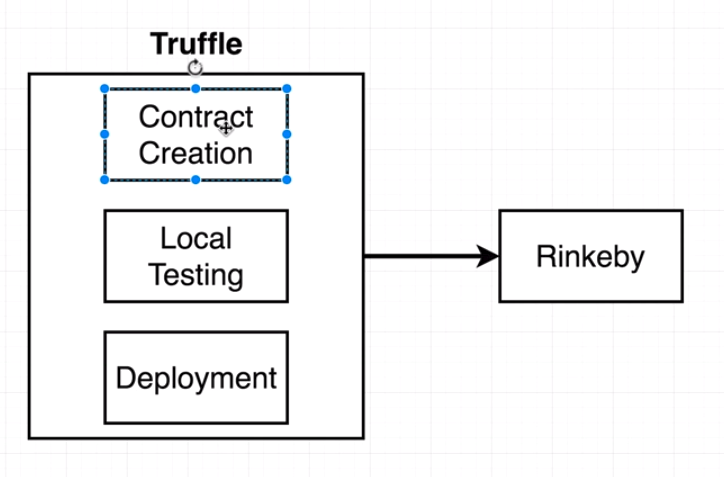

# Ethereum And Solidity

## Introduction

* What is ethereum?


* How can we connect to the network?
  * Developers: `web3.js`
  * Consumers
    * Metamask: Browser extension
    * Mist Browser: Full feature web browser


* Using Metamask
  * Generate an account (mnemonic)
  * You can host your local Ethereum network at local 8545
  * Custom RPC: Connect to a remote network using a custom address


* Metamask account:
  * Account address: shareable unique identifier (username)
  * Public key
  * Private key (both public and private is a like a password)
    * All those pieces of data are stores as hexadecimal numbers


* Sending tokens using Metamask:
  * http://rinkeby-faucet.com/
  
  * What is a transaction?
    * `web3.js`: creates a transaction object
    * 


* How is a blockchain block structured:
    * `nonce`: Basically a counter of transactions done using your account. So, lets say you have done 100 transactions already, that classed your next transaction with a `nonce` of 101
    * `v`, `r`, `s`: Sender generates those values with his private key (one way process). You cannot recalculate the private key
    * When some transactions get assembled inside a block:
    * 
      * The node start running some calculations on the block, that is called Mining
      * Mining is the process of finding a hash  that starts with `0000` 4 0s (signed block).
      * 


* Distributed Blockchain
  * We have many peers with copies of the blockchain. Consequently, if one of the peers changes some past block of his block chain, that will not match his neighbors blockchain.
  * Democracy wins, that means that if peer A is different from B and C (and those are equal), then A is incorrect


* Ethereum blockchain specifics
  * The ethereum hash does not need to start with 4 0s, it actually needs to be a hash that is less than a target value.
  *   
  * Block time: how long does it take to find a valid hash
  * For each block mined, the network will gather that data and calibrate the "difficulty target" for the next blocks
  * 
    * This needs to be calibrated, since at any given time we may have a different number of available computers calculating those hashes.
  * https://etherscan.io/chart/blocktime: A website with a histogram of the average block time


## Smart Contracts

* An account controller by code


* External Account: The ones we create with Metamask and other apps (human beings accounts)
  * Those are also called External Accounts
  * 
  * Many networks


* Contract accounts
  * One network
  * 
  * Contract Source is like a class
  * Contract Instance is like an instance of a class
    * Each instance of that class will be deployed to a network


* Solidity Programming Languages
  * 
  * 
  * 
  * Lets write our first Solidity Contract (remix.ethereum.org

```
pragma solidity ^0.4.17; // Version of solidity we are using

contract Inbox {
    string public message; // storage variable that is carried with the contract

    constructor(string initialMessage) public {
        message = initialMessage;
    }

    function setMessage(string newMessage) public {
        message = newMessage;
    }

    // Not necessary, since messsage is a public property
    function getMessage() public view returns (string) {
        return message;
    }
}
```

  * 
    * `public`: Anyone with an Ethereum account can call it inside our contract
  * Remix has a tine fake network to test our Contracts (Javascript VM)
    * 

    * 
      * If we leave the `to` field as blank, the transaction will be turned into a contracted inside the network
      * `data`: the compiled code of the contract (open code)
      * `value`: We can send some initial amount of money with this contract


  * Interacting with contracts
    * 
    * We call a function to mostly read contract data and not change it
    * We make a transaction to change a contracts data for the most part
      * Sending a transaction to a function cost some amount of `ether`
        * 
        * A `wei` is equal to `ether`
        * For every one dollar we have 100 cents
        * For 1 Ether we have 1,000,000,000,000,000 Wei (no wei fraction)
        * To convert `ether` units: https://etherconverter.online/


  * The gas system
    * Running code is not free
    * In order to get someone else to run our contracts, we have to pay them money (gas)
    * Every operation has a price (example: sum to operands)
      * https://docs.google.com/spreadsheets/d/1n6mRqkBz3iWcOlRem_mO09GtSKEKrAsfO7Frgx18pNU/edit#gid=0
      * 
      * Whenever we issue a transaction that changes the blockchain in any fashion, we have to specify the amount of gas (wei) we are willing to pay to run that transaction
      * Some functions we wont be able to calculate the amount of gas necessary just by looking at the spreed sheet. Consequently, we specify a `gasLimit` to give us flexibility (estimate)
        * An example is a for-loop execution
        * `gasPrice`: I am paying 300 `wei` for gas unit
          * The default gas price is now 0.02 microether which is equivalent to:
            * 0.00000002 Ether (.02 * 1e-6)
            * 0.02e12 wei
            * 20000000000 wei
            * 20e9 wei
            * 20 Gwei (gigawei)
            * 0.02 szabo
        * `gasLimit`: I want to use at max 10 gas units to process this function
        * 
          * If you don't have enough gas to run the function, it will stop mid way
          * 
          * Operations that modify, or store data in the blockchain are gonna cost some amount of money


  * Mnemonic Phrases
    * 
    * This will output private keys, public keys and accounts info.
      * Many accounts (Metamask is a good example)
      * https://iancoleman.io/bip39/: Convert mnemonic into public, private keys and addresses info
        * Metamask for instance will use this Derived Address table to create new accounts
        * 


  * Lets get some Ether
    * faucet.rinkeby.io

  * Truffle: Develop, test and deploy contracts to the Ethereum network
    * 
    * 
    * Lets make a custom Node project to do Truffles task
    * 

  * Check code inside `./inbox/compile.js`
    * To test our contract, we will create our own local network
    * 
    * We will use `web3` to call the ABI interfaces inside the network
    * We will use Ganache as the actual network
      * 
      * Web3 will access the automatically created accounts from ganache
        * We can use those unlocked accounts to send money, deploy contracts, etc..


  * `Web3` contract interactions:
    * 
    * We can also interact with already deployed contracts (we just need the `ABI`, no bytecode required)


  * Deploy contract to Rinkeby (get credits at https://faucet.rinkeby.io/) 
    * You can deploy a contract by running a node inside the Rinkeby network and communicating with it directly. However, this is a complicated process and we can use a third-party api to do the job (Infura)
    * https://infura.io/
    * `node deploy.js`: Deploying a contract to Rinkeby
      * https://rinkeby.etherscan.io/tx/0x3f19a15bea133538967c9b3969e21a3c45479880d330340f6608909670f47588
    * We can also interact with this new contract by using http://remix.ethereum.org/
      * Copy the code from `Inbox.sol` and compile it inside remix
      * Select the `Injected Web3` env to connect to your Metamask account
      * Input your contract address
      * Run! (it should take 30sec to a minute)
        * This will run inside the Rinkeby network
      * 
      * 
        * Remember, we need to submit some `ether` to run a transaction that changes the contract data
        * Running `message` does not change the contract, that is why it is free

## Solidity

* Types


* The message global variable
  * `msg` object
    * Account
    * Transaction
    * Available with any function invocation
    * Global variable to describe who sent in a function invocation
    * 
      * Call or transaction
        * `msg.data`: On contract creation it has the contract source code, and if we were trying to invoke a function it would show the arguments we are passing to it
        * `msg.gas`: The amount of gas to run the function
        * `msg.sender`: Address of person/account how invoked function
        * `msg.value`: Amount of ether that was sent with the function invocation

* Check `lottery/contracts/Lottery.sol` for a solid example of the `msg` object.

## Full front-end application using Ethereum

* Check `./lottery-react/src/index.js`
  * To run this guy, deploy the contract inside by running `node ./lottery/deploy.js`
    * Copy the new contract address to `./lottery-react/src/lottery.js`
  * Install Metamask and add some ETH to your account inside the Rinkeby network

* Check `./kickstart` --> Instructions from `lottery-react` applies 
